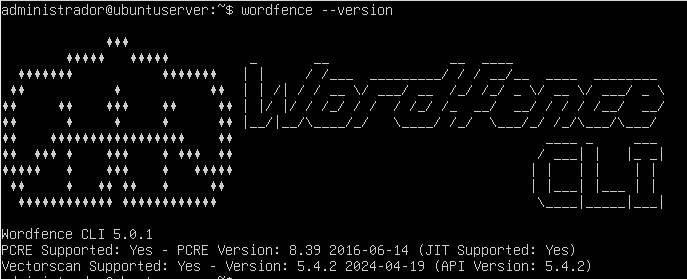

# Automatização - **Wordfence malware-scan + Email**



## 🧠 **O que esse script faz?**

Ele verifica se o seu site WordPress está com arquivos maliciosos usando uma ferramenta chamada **Wordfence** (versão para linha de comando) e envia um relatório por e-mail para algumas pessoas.

---

# 💽 **SCRIPT DA AUTOMAÇÃO**

### 🧰 **Configurações Básicas**

- `WP_PATH`: Caminho onde está instalada a sua instância WordPress.
- `EMAIL_TO`: Lista de e-mails que vão receber o relatório da varredura.
- `LOG_FILE`: Caminho onde o log da varredura será salvo.
- `EMAIL_SUBJECT`: Assunto do e-mail, incluindo a data e hora atual.
- `CONFIG_FILE`: Caminho do arquivo `.ini` usado para configurar o Wordfence CLI.
  
```bash
WP_PATH="/var/www/wordpress"
EMAIL_TO="seuemail@email.com"
LOG_FILE="/var/log/wordfence_scan.log"
EMAIL_SUBJECT="Relatório Wordfence - data"
CONFIG_FILE="/home/administrador/.config/wordfence/wordfence-cli.ini"
```

## 🗒️ **Função de Log**

Essa função serve pra registrar tudo que o script faz. Se der erro ou sucesso, ele escreve no arquivo de log para você poder investigar depois.

```bash
log() {
    echo "data e hora + mensagem" >> arquivo_log
}
```

```bash
log() {
    echo "[$(date '+%Y-%m-%d %H:%M:%S')] $1" >> "$LOG_FILE"
}
```

## 🧼 **Função `prepare()`**

Antes de escanear, ele verifica se está tudo pronto:
- Cria o arquivo de log (caso não exista)
- Vê se o Wordfence está instalado
- Se não estiver, mostra a mensagem “instale com: sudo dpkg -i wordfence.deb”

```bash
prepare() {
    cria log
    verifica se o comando "wordfence" existe
    se não existir, mostra erro
}
```

```bash
prepare() {
sudo touch "$LOG_FILE"
sudo chown "$(whoami)":"$(whoami)" "$LOG_FILE"
if ! command -v wordfence >/dev/null 2>&1; then
log "ERROR: wordfence não encontrado"
echo "ERROR: Instale com: sudo dpkg -i wordfence.deb"
exit 1
fi
}
```

## 🔍 **Função `run_scan()`**

O que está acontecendo aqui:
- Ele escaneia o site com Wordfence.
- Guarda o resultado: se foi tudo bem, se teve algum alerta ou se deu erro.
- Pega as informações principais e cria um relatório.
- Se puder enviar e-mail (se o comando `mail` estiver disponível), ele envia!

```bash
run_scan() {
    roda o escaneamento
    vê o resultado (sucesso, aviso ou erro)
    salva no log
    monta e envia o e-mail (se tiver o comando mail instalado)
}
```

```bash
run_scan() {
log "Iniciando varredura Wordfence..."
SCAN_RESULT=$(wordfence malware-scan "$WP_PATH" --config "$CONFIG_FILE" 2>&1)
SCAN_EXIT=$?
if [ "$SCAN_EXIT" -eq 0 ]; then
STATUS="SUCESSO"
elif [ "$SCAN_EXIT" -eq 1 ]; then
STATUS="AVISO"
else
STATUS="ERRO"
fi  
log "Status: $STATUS - Código de saída: $SCAN_EXIT"
log "Resultado da varredura: $SCAN_RESULT"
if command -v mail >/dev/null 2>&1; then
EMAIL_BODY="
RELATORIO WORDFENCE
────────────────────────────────────
Data: $(date)
Caminho: $WP_PATH
Status: $STATUS
────────────────────────────────────
Resumo do Scan:
────────────────────────────────────
$(echo "$SCAN_RESULT" | grep -E "INFO|WARNING|ERROR")
────────────────────────────────────
Arquivos suspeitos detectados:
──────────────────────────────────── 
$(echo "$SCAN_RESULT" | grep -E "^/var/www/wordpress|Obfuscated")"
echo "$EMAIL_BODY" | iconv -f utf-8 -t utf-8 | mail -s "$EMAIL_SUBJECT" "$EMAIL_TO"
log "Email enviado para: $EMAIL_TO"
else
log "Comando 'mail' não disponível"
fi 
}
```

## 🧪 **Execução Principal**

Você pode testar o script com:
```bash
./seu_script.sh --teste
```

Assim ele mostra informações extras e ainda executa a varredura.

```bash
chama a função prepare
if [ "$1" = "--teste" ]; then
    roda em modo de teste
else
    roda normalmente
fi
```

```bash
prepare
if [ "$1" = "--teste" ]; then
echo "=== MODO DE TESTE ==="
echo "WordPress path: $WP_PATH"
echo "Log file: $LOG_FILE"
run_scan
echo "=== Verifique email e log ==="
else
run_scan
fi
```

---

# 🛠️ Guia de Implementação do Script Wordfence

### 1. 📁 Preparando o Ambiente

Antes de tudo, verifique se os seguintes requisitos estão atendidos:

- Wordfence CLI instalado (`wordfence.deb`)
- Arquivo Wordpress posicionado corretamente (`wordpress.zip >> wordpress`)
  de preferencia em `/var/www/aquivo_aqui`
- Servidor de e-mail configurado com o comando `mail`
- WordPress instalado no caminho correto
- Configuração do Wordfence em `/home/administrador/.config/wordfence/wordfence-cli.ini`
- Permissão de execução no script:
  ```bash
  chmod +x ~/wordfence_scan.sh
  ```

### 2. 🕒 Agendar Execução Semanal com Cron

Você pode configurar o `cron` para rodar o script **duas vezes por semana**, por exemplo, **segunda e quinta às 2h da manhã**.

1. Edite o crontab:
   ```bash
   crontab -e
   ```

2. Adicione esta linha:
   ```bash
   0 2 * * 1,4 ~/wordfence_scan.sh
   ```

🔎 Explicação:
- `0 2`: às 02:00
- `* *`: qualquer dia e mês
- `1,4`: segunda (1) e quinta (4)

### 3. 📬 Envio Automático de E-mail

Seu script já envia e-mails via o comando `mail`, mas certifique-se de que o servidor esteja configurado corretamente:

- Para servidores simples, pode usar `sendmail` ou `mailutils`:
  ```bash
  sudo apt install mailutils
  ```

- Para configurações mais robustas, instale e configure `Postfix`:
  ```bash
  sudo apt install postfix
  ```

💡 Você também pode trocar o `mail` por `mutt`, `ssmtp`, ou integrar com serviços SMTP autenticados, caso deseje enviar por Gmail ou Outlook.

### 4. 🧪 Executar Teste Manual

Quando quiser executar uma varredura de teste com saída no terminal:

```bash
./seu_script.sh --teste
```

Isso roda o scan, imprime informações no terminal, e também registra no log e envia o e-mail conforme o script.

### 5. 📄 Verificando Logs

Após cada execução, o log estará disponível em:

```bash
cat /var/log/wordfence_scan.log
```

Você pode acompanhar alertas e identificar arquivos suspeitos diretamente por ali.

---

# Observação :

## 📪 Casos em que o E-mail não chega ou fica preso...

#### 🧪 1. Teste básico com remetente definido

Tenta rodar isso:

```bash
echo "Teste manual do sistema de email" | mail -s "Teste Wordfence" -r administrador@localhost seuemail@email.com
```

Isso força o remetente como `administrador@localhost`, que às vezes é necessário pra não ser rejeitado pelo servidor de destino.

### 📨 2. Verifique fila de emails locais

Seu sistema pode estar tentando enviar, mas os emails estão presos. Veja:

```bash
mailq
```

Se aparecer uma fila, o problema pode ser na entrega (falta de DNS reverso, rejeição do email, etc.)

## 🚫 Por que o E-Mail não responde?

A  maioria dos provedores modernos **bloqueia conexões diretas por segurança**. Se seu servidor não tiver:

- IP fixo com reputação confiável
- DNS reverso (PTR record) configurado
- SPF, DKIM e DMARC válidos

... ele vai dar time-out toda vez 

## 💡 Solução: usar SMTP autenticado

### ➤ `msmtp` + Gmail, Outlook ou outro servidor SMTP

Com ele, seu script manda e-mail autenticado, usando um servidor de verdade — sem depender de porta 25 bloqueada.

Pode configurar isso pra você com:

- Gmail 
- Outlook
- Servidores SMTP 

---

## 🛠️ Passo a passo para configurar `msmtp` com Gmail (ou outro SMTP)

### 1. 📦 Instalar o `msmtp` e o agente de envio

```bash
sudo apt update
sudo apt install msmtp msmtp-mta
```

### 2. 🗂️ Criar arquivo de configuração personalizado

Crie o arquivo `~/.msmtprc`:

```bash
nano ~/.msmtprc
```

E cole algo como isso para Gmail:

```ini
# Arquivo de configuração do msmtp
defaults
auth           on
tls            on
tls_trust_file /etc/ssl/certs/ca-certificates.crt
logfile        ~/.msmtp.log

account        email
host           smtp.email.com
port           587
from           seuemail@email.com
user           seuemail@email.com
password       sua_senha_de_aplicativo
account default : email
```

> 💡 **Importante:** Para Gmail, você precisa gerar uma **senha de aplicativo** em [https://myaccount.google.com/apppasswords](https://myaccount.google.com/apppasswords). Isso funciona mesmo se a verificação em duas etapas estiver ativada.

📧 Se for usar gmail, Outlook, Yahoo, ou servidor da empresa mude o template...

### 3. 🔐 Ajustar permissões

O arquivo deve ser acessível apenas por você:

```bash
chmod 600 ~/.msmtprc
```

### 4. 🧪 Testar envio manual

```bash
echo "Testando envio via msmtp" | msmtp seuemail@hotmail.com
```

## 🔁 Integrar ao seu script

Basta substituir o trecho do `mail` por:

```bash
echo "$EMAIL_BODY" | iconv -f utf-8 -t utf-8 | msmtp "$EMAIL_TO"
```

---

## Modelo do Email enviado pela aplicação


